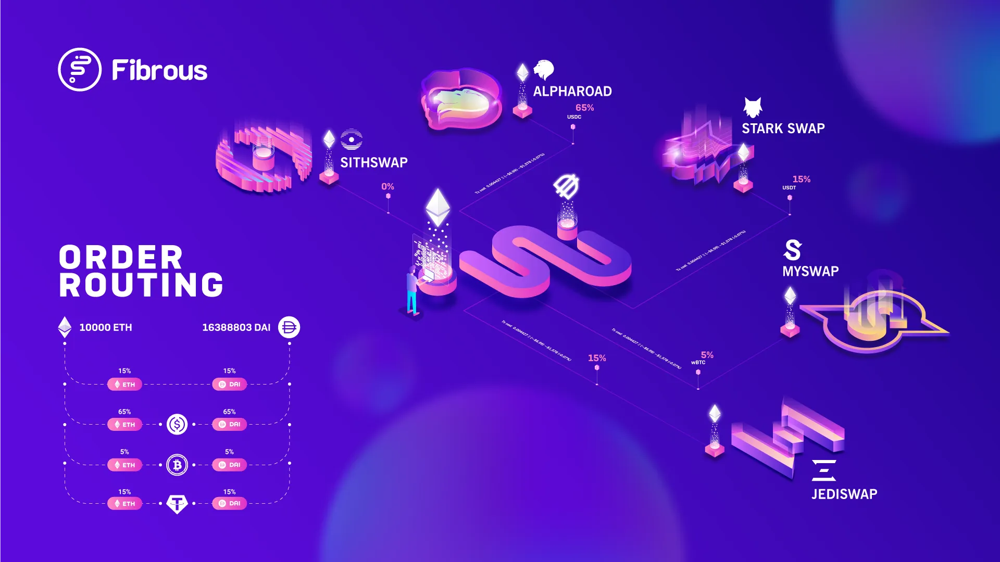

# Fibrous Finance

[Fibrous Finance](https://fibrous.finance) is price exploration and routing algorithm across multiple AMMs that offers token exchanges with best and cheapest rate at Starknet Validity Rollup.

What is an AMM?
An Automated Market Maker (AMM) is a type of decentralized finance (DeFi) protocol that facilitates the trading of assets on blockchain networks. AMMs are designed to automate the process of market making, traditionally performed by centralized exchanges with order books and liquidity providers.

---

# How to use Fibrous SDK

Firstly we will setup the enviroment for usage of fibrous-sdk and we will check some examples from main repo and understand how it works.

1. [Requirements](./chapters/Requirements.md)
2. [Examples](./chapters/Examples.md)
3. [Account](./chapters/Account.md)
4. [An example of Fibrous Bot](./chapters/Fibrous%Bot.md)

---

# Sources
- *Fibrous-SDK github repo is [here](https://github.com/Fibrous-Finance/router-sdk/tree/main).*
- *For more documents about Fibrous are [here](https://docs.fibrous.finance/introduction/an-overview-of-fibrous) availible.*
- *Articles about Fibrous Finance you can find in [medium](https://medium.com/@fibrous).*
- *More starknet js, typescript workshops are [here](https://github.com/PhilippeR26/starknet.js-workshop-typescript).*